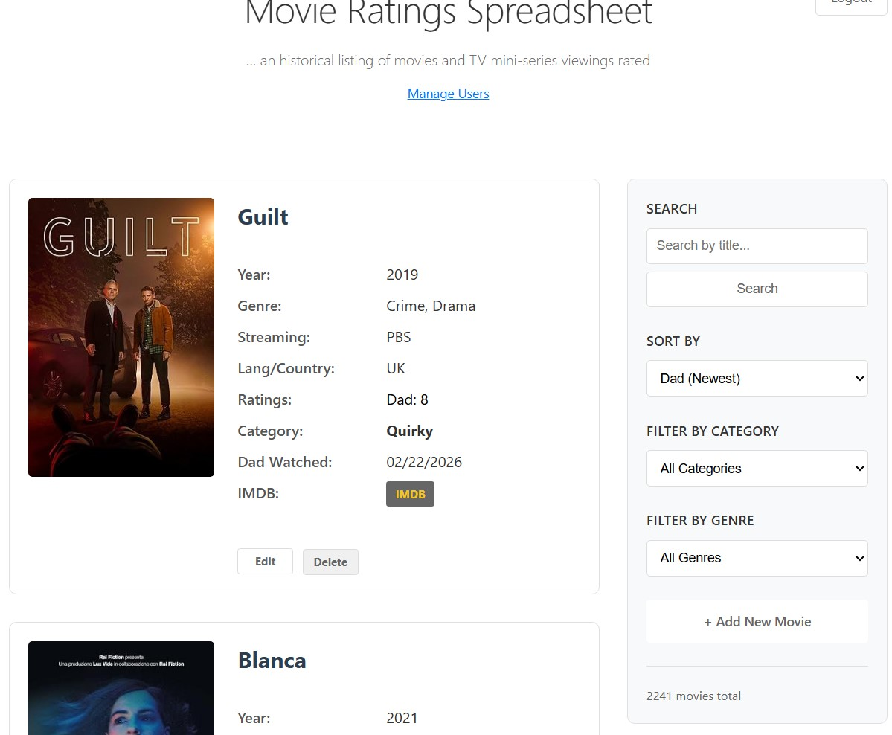

# Movie Ratings List

A web application, minimalist style, for tracking and rating movies and TV mini-series viewings. In days past a shared spreadsheet served this puropose. This is the web version with database. Import your CSV. There is a movie posters import and display feature option, an enhancement over what the orig spreadsheet could do.

## Features

- 📊 View paginated movie listings (10 per page)
- 🔍 Search movies by title or category
- 🔄 Sort by Date Watched, Year, Rating, Category, or Title
- 🖼️ Automatic movie poster fetching from OMDB API
- ✏️ Add new movie entries with a clean form
- 📝 Edit existing entries
- 🐳 Fully Dockerized for easy deployment
- 🎨 Minimalist design with plenty of white space


## Prerequisites

- Docker and Docker Compose installed
- Your Excel file: `Movie Ratings.xlsx`
- (Optional) OMDB API key for movie posters

## Quick Start

### 1. Prepare Your Data

Copy your `Movie Ratings.xlsx` file to the `data/` directory:

```bash
mkdir -p data
# Copy your Excel file to: data/Movie Ratings.xlsx
```

### 2. Get OMDB API Key (Optional but Recommended)

For automatic movie poster fetching:

1. Visit: http://www.omdbapi.com/apikey.aspx
2. Sign up for a FREE API key
3. Create a `.env` file:

```bash
cp .env.example .env
# Edit .env and add your API key:
# OMDB_API_KEY=your_actual_key_here
```

### 3. Build and Run with Docker

```bash
# Build and start the containers
docker-compose up -d

# View logs
docker-compose logs -f
```

The application will be available at: **http://localhost:5000**

### 4. Access the Application

Open your browser and navigate to:
- Main app: http://localhost:5000
- Add movies, search, sort, and enjoy!

## Project Structure

```
movie-ratings-app/
├── app/
│   ├── app.py              # Flask application
│   ├── init_db.py          # Database initialization
│   └── templates/          # HTML templates
│       ├── base.html
│       ├── index.html
│       ├── add_movie.html
│       └── edit_movie.html
├── data/
│   └── Movie Ratings.xlsx  # Your Excel file (add this)
├── posters/                # Movie poster images (auto-generated)
├── docker-compose.yml      # Docker orchestration
├── Dockerfile              # Application container
├── requirements.txt        # Python dependencies
└── README.md              # This file
```

## Excel File Format

The import script expects columns with names containing:
- **Title/Movie/Name** → Movie title (required)
- **Year** → Release year
- **Rating/Score** → Your rating
- **Date/Watched** → Date you watched it
- **Category/Genre/Dad** → Dad's category
- **Note/Comment** → Your notes

The script is flexible and will attempt to auto-detect columns.

## Database Schema

```sql
CREATE TABLE movies (
    id SERIAL PRIMARY KEY,
    title VARCHAR(500) NOT NULL,
    year INTEGER,
    rating VARCHAR(50),
    date_watched DATE,
    dads_category VARCHAR(200),
    notes TEXT,
    poster_path VARCHAR(500),
    created_at TIMESTAMP,
    updated_at TIMESTAMP
);
```

## Docker Commands

```bash
# Start the application
docker-compose up -d

# Stop the application
docker-compose down

# View logs
docker-compose logs -f

# Rebuild after code changes
docker-compose up -d --build

# Remove everything including database
docker-compose down -v
```

## Deployment on Proxmox LXC

### Method 1: Docker in LXC (Recommended)

1. Create an Ubuntu LXC container in Proxmox
2. Make it privileged or enable nesting:
   ```bash
   # In Proxmox host
   pct set <CTID> -features nesting=1
   ```

3. Inside the LXC, install Docker:
   ```bash
   curl -fsSL https://get.docker.com | sh
   usermod -aG docker $USER
   ```

4. Copy this project to the LXC:
   ```bash
   scp -r movie-ratings-app/ root@<lxc-ip>:/opt/
   ```

5. Run the application:
   ```bash
   cd /opt/movie-ratings-app
   docker-compose up -d
   ```

6. Access via LXC IP: `http://<lxc-ip>:5000`

### Method 2: Native Python in LXC

If you prefer not to use Docker inside LXC:

1. Create Ubuntu LXC
2. Install dependencies:
   ```bash
   apt update
   apt install -y python3 python3-pip python3-venv postgresql
   ```

3. Set up PostgreSQL and create database
4. Clone/copy the application
5. Install Python packages and run with gunicorn

## Troubleshooting

### Database not connecting
```bash
# Check if database is ready
docker-compose logs db

# Restart services
docker-compose restart
```

### Excel import failed
- Check that `Movie Ratings.xlsx` is in the `data/` directory
- Verify column names match expected patterns
- Check logs: `docker-compose logs web`

### Posters not loading
- Ensure you have an OMDB API key in `.env`
- Check logs for API errors
- Placeholder will show if poster unavailable

### Port 5000 already in use
Edit `docker-compose.yml` and change the port mapping:
```yaml
ports:
  - "8080:5000"  # Use port 8080 instead
```

## Customization

### Change the port
Edit `docker-compose.yml`:
```yaml
ports:
  - "8080:5000"  # Change 8080 to your preferred port
```

### Modify the design
Edit `app/templates/base.html` to customize styles.

### Add more fields
1. Update database schema in `app/init_db.py`
2. Modify templates to display new fields
3. Update `app/app.py` routes to handle new data

## Backup

To backup your data:

```bash
# Backup database
docker-compose exec db pg_dump -U postgres movieratings > backup.sql

# Backup posters
tar -czf posters-backup.tar.gz posters/
```

To restore:

```bash
# Restore database
docker-compose exec -T db psql -U postgres movieratings < backup.sql

# Restore posters
tar -xzf posters-backup.tar.gz
```

## Credits

- Flask web framework
- PostgreSQL database
- OMDB API for movie data
- Docker for containerization

## License

Free to use and modify for personal use.

---

**Blog:** [blog.strombotne.com](http://blog.strombotne.com)
